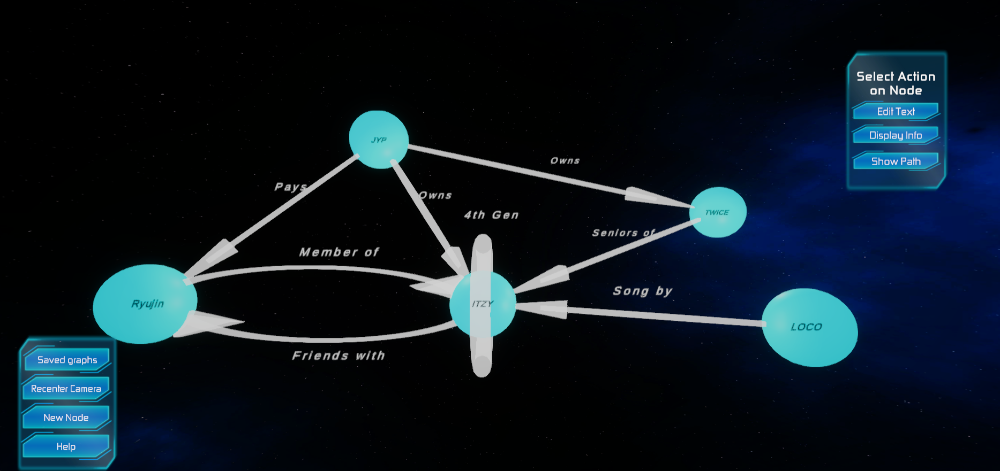

# SolarSystem
The objective of this project was to create a three-dimensional mind mapping application called Mudimaap (MUltiDImensional MApping APplication). Mind maps are graphical tools commonly used to demonstrate relationships between different ideas or entities. They are ubiquitous, used in businesses to help manage the distribution of work, and in educational environments to aid the comprehension of a topic. Mind maps traditionally represent data in two dimensions, which offers the advantage of being quick to construct and simple to view. As a topic grows in complexity, 2D mind maps may suffer from becoming too “cluttered”, an issue that can be remedied by adding a third dimension to the mind map providing more space for additional data. This is the impetus behind the development Mudimaap.

## Note on Design Choices:
The overall software organisation is shown below: 

We designed the frontend in Unity, a video game engine. We wished to create a
3D environment with precise, user-friendly navigation, appropriate visualisation capabilities and a nice
appearance, while retaining good response times is challenging, and Unity provides a solid framework
for this. Unity was chosen over more simplistic solutions such as direct implementation in WebGL
and WebAssembler due to the helpful functionalities it provides by default.
The front-end communicates with the NoSQL database Neo4j, where the nodes and relationships are stored.
Neo4j was chosen over a traditional SQL database due to its flexibility in modelling relationships between entities. In addition, it was chosen over GraphDB
(another graph database) because it allowed edges between nodes to hold data. This feature is not
available in GraphDB, but is critical to developing a compact and informative mind map

